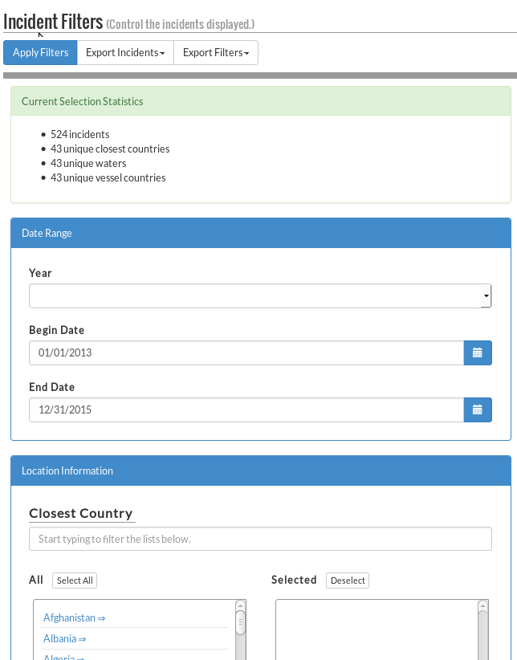
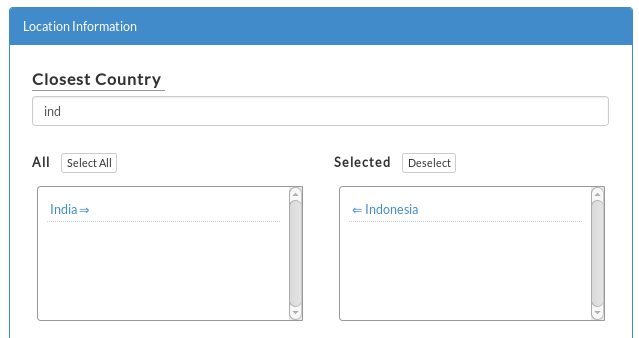
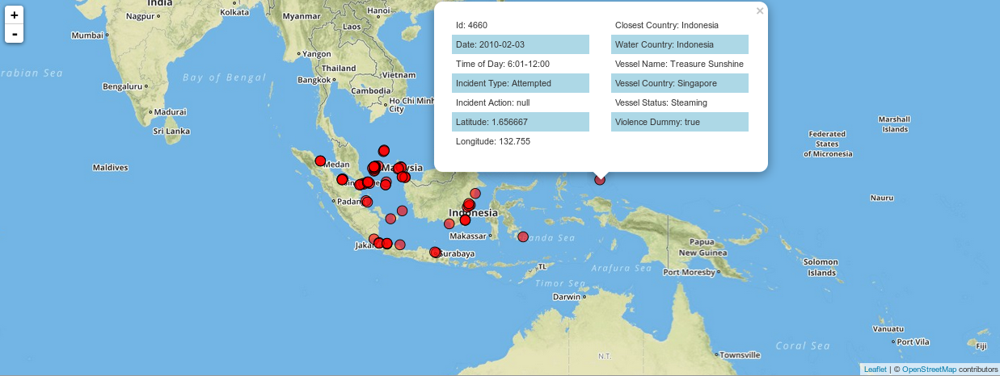
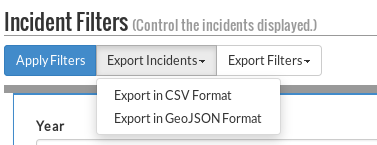
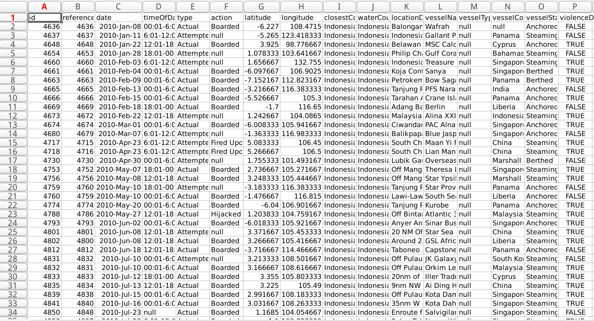

#MPMAP Usage

##Contents

1. Functionality
2. Usage Examples

##1. Functionality

MPMAP provides the following functionality:

- Filter 6500+ maritime piracy incidents on date, location, vessel, and conflict parameters.
- Map the filtered incidents with informational popups.
- Export the filtered incidents in CSV or GeoJSON format and the applied filters in JSON format.
- Analyze the filtered incidents via a graph displaying incidents per year by closest country.

##2. Usage Examples

###a. Filter Incidents

To filter the incidents, use the Incident Filters pane on the left of the screen. Scroll down to view all of the possible filters.

Location, vessel, and conflict filters are applied via a filtering mechanism that allows you to easily search and add multiple parameters. Simply start typing the name of your desired parameter, and click on it in the "All" field to use it as a search parameter.

###b. View the Filtered Incidents on the Map

Once filtered, the incidents are rendered on the map as red, semi-transparent circles. These can be clicked to reveal more information about the incident. The map can be dragged and zoomed to view the incidents in greater or lesser detail.

###c. Export the Filtered Incidents and Applied Filters

Once filtered, the incidents can be exported in **CSV or GeoJSON format**. The applied filters can be exported in **JSON format**.

###d. Analyze the Filtered Incidents  