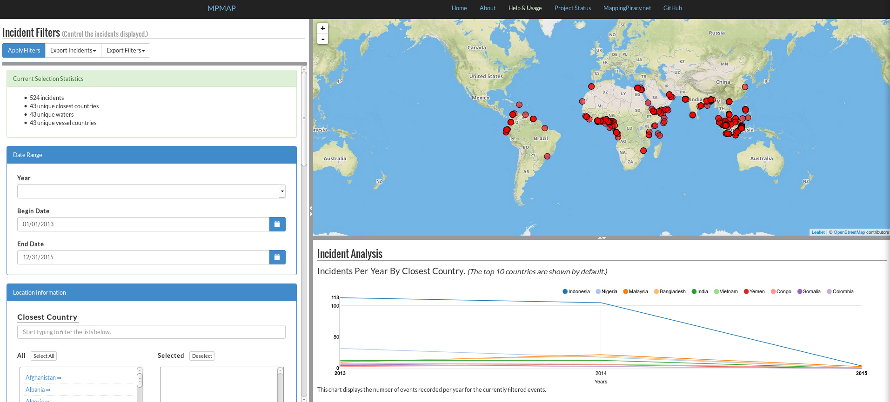

#MPMAP Usage

##Contents

1. Functionality
2. Usage Examples

##1. Functionality

MPMAP provides the following functionality:

- Filter 6500+ maritime piracy incidents on date, location, vessel, and conflict parameters.
- Map the filtered incidents with informational popups.
- Export the filtered incidents in CSV or GeoJSON format and the applied filters in JSON format.
- Analyze the filtered incidents via a graph displaying incidents per year by closest country.

##2. Usage Examples

###a. Filter Incidents

To filter the incidents, use the Incident Filters pane on the left of the screen. Scroll down to view all of the possible filters.

###b. View the Filtered Incidents on the Map

###c. Export the Filtered Incidents

###d. Analyze the Filtered Incidents  